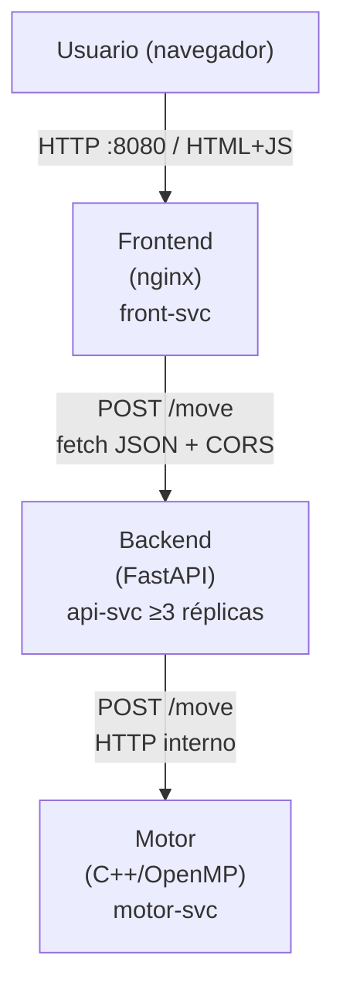

# 01 – Arquitectura del Sistema

## Visión general

El sistema está compuesto por cuatro servicios independientes, cada uno en su propio contenedor Docker y desplegado como un Deployment de Kubernetes independiente. Esta separación permite escalar, reiniciar y actualizar cada componente sin afectar a los demás.

Los componentes son:

- **Motor** (C++/OpenMP): implementa los algoritmos de búsqueda y expone un endpoint HTTP interno en el puerto 9000.
- **Backend** (Python/FastAPI): recibe las peticiones del frontend, valida la entrada y delega el cálculo al motor por la red interna del clúster.
- **Frontend** (HTML/JS + nginx): sirve los archivos estáticos de la interfaz de usuario en el puerto 80.
- **Base de datos** (opcional, no implementada): si se desea persistir partidas o benchmarks, se agrega un contenedor PostgreSQL con su propio PersistentVolumeClaim.

## Diagrama de orquestación



## Descripción de contenedores

| Contenedor | Imagen base | Puerto interno | Rol |
|---|---|---|---|
| motor | ubuntu:22.04 | 9000 | Cómputo de jugadas (Alfa-Beta / MCTS) |
| backend | python:3.11-slim | 8000 | API pública, validación, delegación al motor |
| frontend | nginx:1.25-alpine | 80 | Entrega de archivos estáticos al navegador |

## Contrato de la API REST

### POST /move

**Request:**
```json
{
  "board": [4,4,4,4,4,4,0,4,4,4,4,4,4,0],
  "side": 0,
  "algo": "alphabeta",
  "depth": 8,
  "threads": 4
}
```

**Response (Alfa-Beta):**
```json
{
  "move": 3,
  "evaluation": 7,
  "elapsed_ms": 124,
  "stats": { "algo": "alphabeta", "nodes": 1845210, "prunes": 312088 },
  "threads_used": 4
}
```

**Response (MCTS):**
```json
{
  "move": 3,
  "evaluation": 0.62,
  "elapsed_ms": 118,
  "stats": { "algo": "mcts", "rollouts": 100000, "tree_depth_avg": 14.3, "win_rate": 0.62 },
  "threads_used": 4
}
```

### GET /healthz
Responde `200 {"status":"ok"}` siempre que el proceso esté vivo (liveness probe).

### GET /readyz
Responde `200` solo si el motor es alcanzable (readiness probe).

### GET /metrics
Devuelve métricas agregadas en formato texto compatible con Prometheus.

**Códigos de estado usados:** 200 éxito, 422 fallo de validación del schema, 500 error interno, 503 motor no disponible.

## Política de CORS

El backend declara CORS explícitamente en `app/main.py` con `CORSMiddleware` de FastAPI. Los orígenes permitidos se configuran mediante la variable de entorno `ALLOWED_ORIGINS` (separados por coma), de forma que el mismo Dockerfile sirve tanto para local como para la nube sin recompilar.

Los orígenes configurados son:
- Local: `http://localhost:8080`
- Nube: `https://mancala.tu-dominio.cloud`

No se usa el comodín `*`. Solo se permiten los métodos `GET`, `POST` y `OPTIONS` (necesario para el preflight que el navegador envía antes de cada POST con `Content-Type: application/json`).