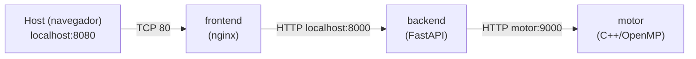

# 04 – Despliegue Local

## Requisitos previos

| Herramienta | Versión mínima | Uso |
|---|---|---|
| Docker Desktop | 24.x | Construir y correr contenedores |
| docker compose | 2.x (incluido en Docker Desktop) | Orquestar los tres servicios localmente |
| kubectl | 1.29 | Aplicar manifiestos en el clúster local |
| minikube o kind | cualquiera reciente | Clúster Kubernetes local |
| cmake + g++ | 3.16 / 12 | Solo si se compila fuera de Docker |

---

## Opción A – docker compose (más rápida para desarrollo)

```bash
# Desde la raíz del repositorio
cd deploy/local
docker compose up --build
```

Servicios disponibles:

| Contenedor | URL en el host |
|---|---|
| Frontend | http://localhost:8080 |
| Backend API | http://localhost:8000 |
| Motor (directo) | http://localhost:9000/healthz |

Para detener y limpiar:

```bash
docker compose down --volumes
```

---

## Opción B – Kubernetes local (minikube / kind)

### 1. Iniciar el clúster

```bash
# Con minikube
minikube start --cpus=4 --memory=4096

# O con kind
kind create cluster --name mancala
```

### 2. Cargar las imágenes locales

```bash
# Construir las imágenes primero
docker build -t mancala-motor:local   motor/
docker build -t mancala-backend:local backend/
docker build -t mancala-frontend:local frontend/

# Cargar en minikube (no necesita push a un registry)
minikube image load mancala-motor:local
minikube image load mancala-backend:local
minikube image load mancala-frontend:local
```

> Con kind usar `kind load docker-image mancala-motor:local --name mancala`.

### 3. Actualizar la referencia de imagen en los manifiestos

En `deploy/local/motor-deployment.yaml`, `backend-deployment.yaml` y `frontend-deployment.yaml`, cambiar la clave `image` al tag local:

```yaml
image: mancala-motor:local
imagePullPolicy: Never      # no intentar descargar del registry
```

### 4. Aplicar los manifiestos

```bash
kubectl apply -f deploy/local/configmap.yaml
kubectl apply -f deploy/local/motor-deployment.yaml
kubectl apply -f deploy/local/motor-service.yaml
kubectl apply -f deploy/local/backend-deployment.yaml
kubectl apply -f deploy/local/backend-service.yaml
kubectl apply -f deploy/local/frontend-deployment.yaml
kubectl apply -f deploy/local/frontend-service.yaml
```

### 5. Verificar estado de los pods

```bash
kubectl get pods
kubectl get services
```

Salida esperada:

```
NAME                        READY   STATUS    RESTARTS   AGE
motor-xxxxxxxxx-xxxxx       1/1     Running   0          30s
backend-xxxxxxxxx-xxxxx     1/1     Running   0          28s
backend-xxxxxxxxx-yyyyy     1/1     Running   0          28s
backend-xxxxxxxxx-zzzzz     1/1     Running   0          28s
frontend-xxxxxxxxx-xxxxx    1/1     Running   0          25s
```

### 6. Acceder a la aplicación

```bash
# Con minikube
minikube service front-svc --url
# Devuelve algo como http://192.168.49.2:30080

# Con kind (requiere port-forward)
kubectl port-forward svc/front-svc 8080:80
# Abrir http://localhost:8080
```

---

## Descripción de los Dockerfiles

### motor/Dockerfile

Usa una imagen multi-stage. La etapa `builder` (ubuntu:22.04) instala cmake, g++ y libgomp-dev, compila el motor en modo Release con `cmake --build`. La etapa final copia solo el binario `mancala_motor` y la librería de runtime de OpenMP (`libgomp1`), resultando en una imagen de ~50 MB.

### backend/Dockerfile

Basada en `python:3.11-slim`. Copia primero `requirements.txt` para aprovechar la caché de capas de Docker (si el código cambia pero las dependencias no, pip no se vuelve a ejecutar). Expone el puerto 8000 y lanza uvicorn en modo producción.

### frontend/Dockerfile

Basada en `nginx:1.25-alpine`. Copia los tres archivos estáticos (`index.html`, `style.css`, `app.js`) y la configuración personalizada de nginx. La imagen resultante es de ~25 MB.

---

## Diagrama de red local (docker compose)



En docker compose los contenedores se comunican por nombre de servicio dentro de la red interna `bridge` que compose crea automáticamente.

---

## Evidencias de despliegue local

*(Insertar capturas de pantalla de: `docker compose ps`, `kubectl get pods`, la interfaz del juego en el navegador y al menos una petición exitosa a `POST /move` desde la UI.)*