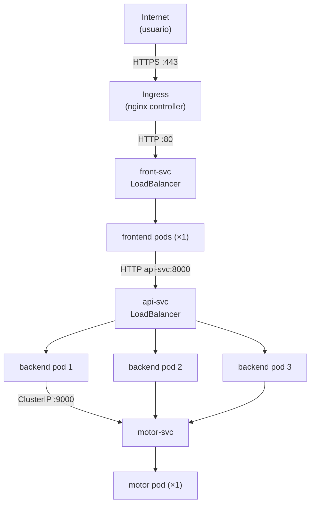

# 05 – Despliegue en la Nube con Kubernetes

## Proveedor elegido

*(Indicar el proveedor real: AWS EKS / Azure AKS / Google GKE. Esta plantilla usa GKE como ejemplo; ajustar los comandos según el proveedor.)*

**Proveedor**: Google Kubernetes Engine (GKE)
**Región**: `us-central1`
**Tipo de nodo**: `e2-standard-4` (4 vCPU, 16 GB RAM)
**Número de nodos**: 2

---

## 1. Crear el clúster en la nube

```bash
# GKE — crear clúster de 2 nodos
gcloud container clusters create mancala-cluster \
  --zone us-central1-a \
  --num-nodes 2 \
  --machine-type e2-standard-4

# Obtener credenciales para kubectl
gcloud container clusters get-credentials mancala-cluster \
  --zone us-central1-a
```

---

## 2. Publicar las imágenes en el registry

Las imágenes se publican automáticamente desde el pipeline CI (`ci.yml`) al hacer push a `main`. Para publicar manualmente:

```bash
# Autenticarse en GHCR
echo $GITHUB_TOKEN | docker login ghcr.io -u TU_USUARIO --password-stdin

# Etiquetar y publicar
docker tag mancala-motor:local   ghcr.io/TU_USUARIO/mancala-motor:v1.0.0
docker tag mancala-backend:local ghcr.io/TU_USUARIO/mancala-backend:v1.0.0
docker tag mancala-frontend:local ghcr.io/TU_USUARIO/mancala-frontend:v1.0.0

docker push ghcr.io/TU_USUARIO/mancala-motor:v1.0.0
docker push ghcr.io/TU_USUARIO/mancala-backend:v1.0.0
docker push ghcr.io/TU_USUARIO/mancala-frontend:v1.0.0
```

---

## 3. Aplicar los manifiestos de la nube

```bash
kubectl apply -f deploy/cloud/configmap.yaml
kubectl apply -f deploy/cloud/motor-deployment.yaml
kubectl apply -f deploy/cloud/motor-service.yaml
kubectl apply -f deploy/cloud/backend-deployment.yaml
kubectl apply -f deploy/cloud/backend-service.yaml
kubectl apply -f deploy/cloud/frontend-deployment.yaml
kubectl apply -f deploy/cloud/frontend-service.yaml
kubectl apply -f deploy/cloud/frontend-ingress.yaml
```

---

## 4. Verificar el despliegue

```bash
# Ver estado de todos los pods
kubectl get pods -o wide

# Ver servicios y sus IPs externas asignadas por el LoadBalancer
kubectl get services

# Ver el Ingress del frontend
kubectl get ingress
```

Salida esperada de `kubectl get services`:

```
NAME         TYPE           CLUSTER-IP      EXTERNAL-IP      PORT(S)
motor-svc    ClusterIP      10.96.0.10      <none>           9000/TCP
api-svc      LoadBalancer   10.96.0.11      34.X.X.X         8000:30800/TCP
front-svc    LoadBalancer   10.96.0.12      34.X.X.Y         80:30080/TCP
```

---

## 5. Réplicas del backend

El manifest `deploy/cloud/backend-deployment.yaml` declara `replicas: 3`. Verificar:

```bash
kubectl get deployment backend
```

```
NAME      READY   UP-TO-DATE   AVAILABLE
backend   3/3     3            3
```

Kubernetes balancea el tráfico entre las tres réplicas automáticamente a través del Service `api-svc`.

---

## Diagrama de red en la nube



---

## Probes de Kubernetes

Los tres Deployments definen `livenessProbe` y `readinessProbe` apuntando a `/healthz` (motor y frontend) y a `/readyz` (backend). Kubernetes reinicia automáticamente cualquier pod que falle la liveness probe, y no enruta tráfico a pods que no pasen la readiness probe.

---

## Evidencias de despliegue en la nube

*(Insertar capturas de: `kubectl get pods -o wide` mostrando los nodos asignados, `kubectl get services` con las IPs externas, la interfaz del juego accedida desde el dominio público, y al menos una petición `POST /move` exitosa con el juego en la nube.)*