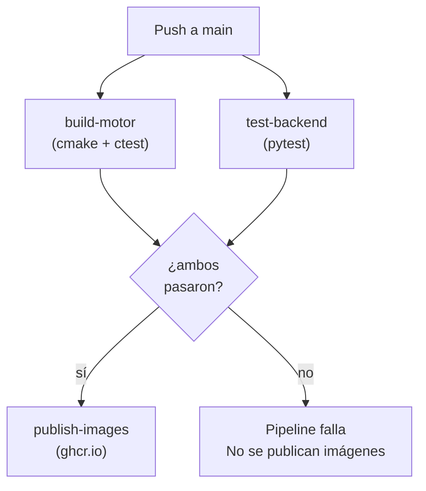

# 06 – CI/CD y Calidad de Código

## Estructura del pipeline

El repositorio tiene dos workflows en `.github/workflows/`:

| Archivo | Se activa | Qué hace |
|---|---|---|
| `ci.yml` | Push o PR a `main` | Compilar motor, correr tests, publicar imágenes Docker |
| `sonarqube.yml` | Push o PR a `main` | Análisis estático de calidad con SonarQube |

---

## ci.yml — Detalle de jobs

### Job 1: `build-motor`

Corre en `ubuntu-22.04`. Instala `cmake`, `g++` y `libgomp-dev` mediante `apt-get`, compila el motor en modo `Release` con cmake y ejecuta los tests unitarios con `ctest --output-on-failure`.

Si cualquier test falla, el job falla y los siguientes jobs no se ejecutan (`needs: [build-motor, test-backend]`).

### Job 2: `test-backend`

Instala Python 3.11 con `actions/setup-python`, instala las dependencias del backend con `pip install -r requirements.txt` y ejecuta `pytest tests/ -v`.

Los tests del backend usan `unittest.mock.patch` para reemplazar `call_motor` con un mock asíncrono, de forma que no se necesita el contenedor del motor para correr en CI.

### Job 3: `publish-images`

Solo corre si el evento es `push` (no en PRs). Depende de que los dos jobs anteriores hayan pasado. Se autentica en `ghcr.io` con `docker/login-action` usando el token automático `GITHUB_TOKEN` (no requiere secret adicional). Construye y publica las tres imágenes etiquetadas con el SHA del commit para trazabilidad inmutable.

---

## Diagrama del pipeline CI



---

## sonarqube.yml — Análisis de calidad

El análisis SonarQube se declara completamente en YAML usando la action oficial `sonarsource/sonarqube-scan-action@v2`. No se usa el plugin del marketplace de GitHub.

**Configuración relevante:**

```yaml
- name: SonarQube Scan
  uses: sonarsource/sonarqube-scan-action@v2
  env:
    SONAR_TOKEN: ${{ secrets.SONAR_TOKEN }}
    SONAR_HOST_URL: ${{ secrets.SONAR_HOST_URL }}
  with:
    args: >
      -Dsonar.projectKey=mancala-kalah
      -Dsonar.sources=motor/src,backend/app,frontend
      -Dsonar.exclusions=**/build/**,**/__pycache__/**
      -Dsonar.python.version=3.11
```

**Secrets necesarios** (configurar en Settings → Secrets → Actions del repositorio):

| Secret | Valor |
|---|---|
| `SONAR_TOKEN` | Token generado en el servidor SonarQube |
| `SONAR_HOST_URL` | URL del servidor (ej. `https://sonarcloud.io`) |

---

## Secrets del repositorio

| Secret | Quién lo usa | Descripción |
|---|---|---|
| `GITHUB_TOKEN` | `ci.yml` → publish-images | Autenticación automática en GHCR, provisto por GitHub |
| `SONAR_TOKEN` | `sonarqube.yml` | Token de autenticación en SonarQube |
| `SONAR_HOST_URL` | `sonarqube.yml` | URL del servidor SonarQube |

---

## Evidencias del pipeline

*(Insertar capturas de: la ejecución exitosa del pipeline en la pestaña Actions de GitHub, el resultado del análisis de calidad en el dashboard de SonarQube, y el listado de imágenes publicadas en el registry GHCR.)*