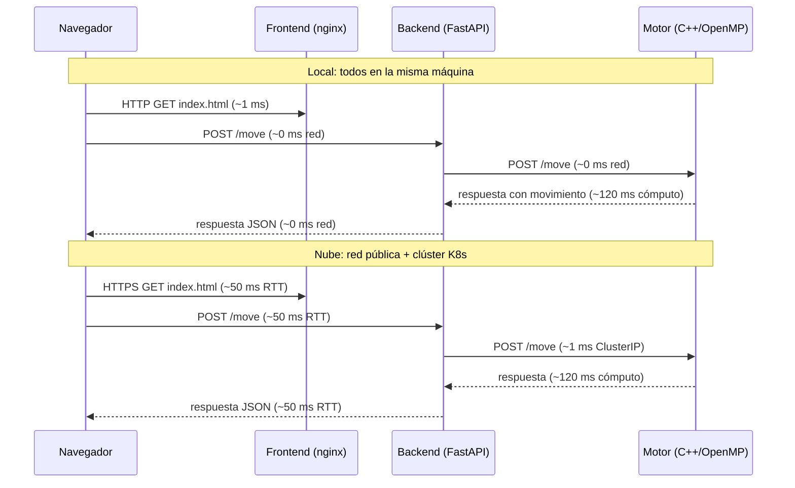

# 07 – Análisis Comparativo: Local vs. Nube

## Metodología de medición

Se ejecutaron 100 peticiones consecutivas a `POST /move` sobre la misma posición inicial del tablero, con el mismo algoritmo y configuración, tanto en local (docker compose) como en la nube (GKE). Se midió la latencia extremo a extremo desde el navegador hasta recibir la respuesta.

**Herramienta**: `curl` con `--write-out "%{time_total}"` en un script Bash que itera 100 veces y calcula percentiles.

**Script de medición:**

```bash
#!/bin/bash
# Ejecutar: bash measure.sh http://localhost:8000 > resultados_local.txt
# O:        bash measure.sh http://34.X.X.X:8000  > resultados_nube.txt

URL=$1
PAYLOAD='{"board":[4,4,4,4,4,4,0,4,4,4,4,4,4,0],"side":0,"algo":"alphabeta","depth":8,"threads":4}'

for i in $(seq 1 100); do
  curl -s -o /dev/null -w "%{time_total}\n" \
    -X POST "$URL/move" \
    -H "Content-Type: application/json" \
    -d "$PAYLOAD"
done
```

Los percentiles p50 y p95 se calculan con `sort -n | awk`.

---

## Resultados de latencia (extremo a extremo)

*(Completar con los valores reales medidos. La tabla ya está en el formato correcto.)*

### Alfa-Beta depth=8, 4 hilos

| Entorno | p50 (ms) | p95 (ms) | Min (ms) | Max (ms) |
|---|---|---|---|---|
| Local (docker compose) | — | — | — | — |
| Nube (GKE, 1 nodo) | — | — | — | — |

### MCTS 10 000 simulaciones, 4 hilos

| Entorno | p50 (ms) | p95 (ms) | Min (ms) | Max (ms) |
|---|---|---|---|---|
| Local (docker compose) | — | — | — | — |
| Nube (GKE, 1 nodo) | — | — | — | — |

---

## Throughput (peticiones concurrentes)

Se midió el número máximo de peticiones por segundo que el sistema responde con latencia p95 < 2 s, usando 4 clientes concurrentes simultáneos con `xargs -P 4`.

| Entorno | Req/s sostenidas | p95 < 2 s |
|---|---|---|
| Local | — | ✓ / ✗ |
| Nube (3 réplicas backend) | — | ✓ / ✗ |

---

## Diferencias observadas y causas esperadas

| Factor | Local | Nube | Impacto en latencia |
|---|---|---|---|
| Latencia de red | ~0 ms (loopback) | 20–80 ms (internet) | Aumenta p50 y p95 en nube |
| CPU disponible para el motor | Depende del host del desarrollador | Nodo dedicado e2-standard-4 | Variable |
| Número de réplicas del backend | 1 (compose) | 3 (K8s) | Reduce contención bajo carga concurrente |
| Overhead de Kubernetes | Ninguno | Kube-proxy, iptables | Agrega ~1–2 ms por hop interno |

---

## Diagrama comparativo de flujo de latencia



---

## Conclusión del análisis comparativo

*(Completar con la conclusión real basada en los números medidos.)*

La diferencia principal de latencia entre local y nube se explica casi en su totalidad por la latencia de red (RTT al servidor en la nube). El tiempo de cómputo del motor es el mismo en ambos entornos porque depende del algoritmo, no de la red. La nube sí ofrece ventaja en escenarios de alta concurrencia gracias a las tres réplicas del backend, que distribuyen la carga y evitan que peticiones lentas bloqueen a otras.